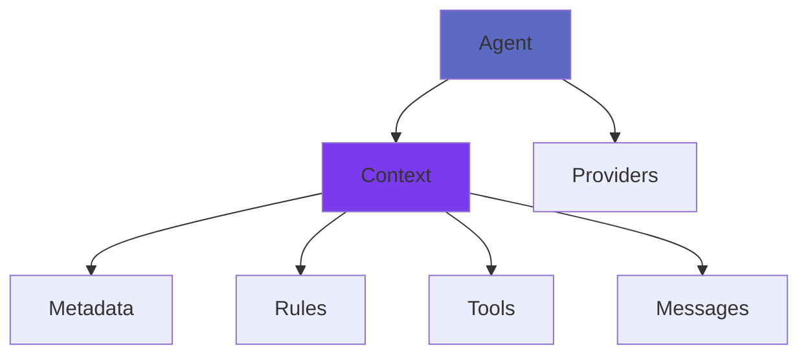

# Core Concepts

Understanding the core concepts of @arcaelas/agent will help you build sophisticated AI applications efficiently.

## Architecture Overview

@arcaelas/agent is built on four interconnected concepts:



### 1. Agent - The Orchestrator

**Agent** is the central class that coordinates everything. It combines:

- **Identity**: Name and description
- **Behavior**: Rules and guidelines
- **Capabilities**: Tools and functions
- **Intelligence**: Provider functions

```typescript
const agent = new Agent({
  name: "Customer_Support",
  description: "Expert customer support specialist",
  tools: [search_tool, ticket_tool],
  rules: [professional_rule],
  providers: [openai_provider, claude_provider]
});
```

**Key Features:**

- Automatic tool execution
- Provider failover
- Context inheritance
- Message history management

**[Learn more →](../api/agent.md)**

### 2. Context - Reactive State Management

**Context** provides hierarchical state management with automatic inheritance. Think of it as a configuration layer that can be shared and extended.

```typescript
// Parent context
const company_context = new Context({
  metadata: new Metadata().set("org", "Acme Corp"),
  rules: [new Rule("Be professional")]
});

// Child context inherits from parent
const sales_context = new Context({
  context: company_context,  // Inherits everything
  metadata: new Metadata().set("dept", "Sales"),
  tools: [crm_tool]
});
```

**Inheritance Rules:**

- **Metadata**: Child can override parent values
- **Rules**: Child adds to parent rules
- **Tools**: Child tools override parent by name
- **Messages**: Combined from parent and child

**[Learn more →](../api/context.md)**

### 3. Metadata - Key-Value Store

**Metadata** is a reactive key-value store with inheritance. Perfect for configuration and state.

```typescript
const parent = new Metadata()
  .set("theme", "light")
  .set("lang", "en");

const child = new Metadata(parent)
  .set("theme", "dark");  // Override

console.log(child.get("theme"));  // "dark" (overridden)
console.log(child.get("lang"));   // "en" (inherited)
```

**Use Cases:**

- Application configuration
- User preferences
- Feature flags
- Session data

**[Learn more →](../api/metadata.md)**

### 4. Tools - Function Execution

**Tools** encapsulate functions that agents can execute. They can be simple or complex.

**Simple Tool:**
```typescript
const time_tool = new Tool("get_time", async (agent) => {
  return new Date().toLocaleString();
});
```

**Advanced Tool:**
```typescript
const search_tool = new Tool("search_database", {
  description: "Search customer database",
  parameters: {
    query: "Search query string",
    limit: "Maximum results (default: 10)"
  },
  func: async (agent, params) => {
    const results = await database.search(params.query, params.limit || 10);
    return JSON.stringify(results);
  }
});
```

**Key Features:**

- Automatic parameter validation
- Async execution support
- Error handling
- Reusable across agents

**[Learn more →](../api/tool.md)**

### 5. Rules - Behavioral Guidelines

**Rules** define how agents should behave. They can be static or conditional.

**Static Rule:**
```typescript
const professional_rule = new Rule(
  "Always maintain a professional and courteous tone"
);
```

**Conditional Rule:**
```typescript
const business_hours_rule = new Rule(
  "Inform about office hours availability",
  {
    when: (agent) => {
      const hour = new Date().getHours();
      return hour < 9 || hour > 17;
    }
  }
);
```

**[Learn more →](../api/rule.md)**

### 6. Messages - Conversation History

**Messages** represent individual messages in a conversation. Types include:

- `user` - Messages from the user
- `assistant` - Responses from the agent
- `tool` - Results from tool execution
- `system` - System-level instructions

```typescript
const user_msg = new Message({
  role: "user",
  content: "What's the weather?"
});

const tool_msg = new Message({
  role: "tool",
  tool_call_id: "weather_123",
  content: "Sunny, 22°C"
});
```

**[Learn more →](../api/message.md)**

### 7. Providers - AI Integration

**Providers** are functions that integrate with AI services. They receive context and return completions.

```typescript
const openai_provider = async (ctx) => {
  const openai = new OpenAI({ apiKey: process.env.OPENAI_API_KEY });

  return await openai.chat.completions.create({
    model: "gpt-4",
    messages: ctx.messages.map(m => ({
      role: m.role,
      content: m.content
    })),
    tools: ctx.tools?.map(tool => ({
      type: "function",
      function: {
        name: tool.name,
        description: tool.description,
        parameters: { type: "object", properties: tool.parameters }
      }
    }))
  });
};
```

**Multi-Provider Failover:**

```typescript
const agent = new Agent({
  name: "Resilient_Agent",
  description: "High-availability agent",
  providers: [
    openai_provider,    // Primary
    claude_provider,    // Backup 1
    groq_provider       // Backup 2
  ]
});
```

If the primary fails, the agent automatically tries backup providers in order.

**[Learn more →](../api/providers.md)**

## Data Flow

Understanding how data flows through the system:

1. **User Input** → Agent receives prompt
2. **Context Building** → Agent prepares context with messages, tools, rules
3. **Provider Call** → Provider receives context, returns completion
4. **Tool Execution** → If completion includes tool calls, execute them
5. **Loop** → Repeat steps 3-4 until completion or failure
6. **Response** → Return final messages and success status

```typescript
const [messages, success] = await agent.call("Hello");
//     ^^^^^^^^  ^^^^^^^
//     Full conversation history
//                Success indicator
```

## Reactive Architecture

The reactive architecture means changes propagate automatically:

```typescript
const parent_context = new Context({
  metadata: new Metadata().set("version", "1.0")
});

const child_context = new Context({
  context: parent_context
});

// Child automatically sees parent's metadata
console.log(child_context.metadata.get("version"));  // "1.0"

// Changes in parent don't affect existing child references
// But new children get updated values
parent_context.metadata.set("version", "2.0");
```

## Best Practices

### 1. Context Organization

Organize contexts by scope:

```typescript
// Global company context
const company_ctx = new Context({ ... });

// Department contexts
const sales_ctx = new Context({ context: company_ctx, ... });
const support_ctx = new Context({ context: company_ctx, ... });

// Team contexts
const sales_team_a = new Context({ context: sales_ctx, ... });
```

### 2. Tool Design

Keep tools focused and reusable:

```typescript
// ✅ Good: Focused, single responsibility
const get_weather = new Tool("get_weather", { ... });
const get_forecast = new Tool("get_forecast", { ... });

// ❌ Bad: Too broad
const weather_everything = new Tool("weather", { ... });
```

### 3. Provider Strategy

Always have fallback providers:

```typescript
providers: [
  primary_provider,      // Fast, preferred
  backup_provider,       // Reliable fallback
  emergency_provider     // Last resort
]
```

### 4. Error Handling

Handle errors gracefully:

```typescript
const [messages, success] = await agent.call(prompt);

if (!success) {
  // Log error
  console.error("Agent failed to respond");

  // Retry or fallback
  await retry_mechanism();
}
```

## Common Patterns

### Pattern: Specialized Agents

Create specialized agents for different tasks:

```typescript
const search_agent = new Agent({
  name: "Search_Agent",
  description: "Expert in searching and finding information",
  tools: [web_search, doc_search, db_search]
});

const writer_agent = new Agent({
  name: "Writer_Agent",
  description: "Expert in writing and content creation",
  tools: [grammar_check, style_check, plagiarism_check]
});
```

### Pattern: Agent Chaining

Chain agents for complex workflows:

```typescript
async function complex_task(input) {
  // Step 1: Research
  const [research, success1] = await research_agent.call(input);

  // Step 2: Analysis
  const analysis_input = research[research.length - 1].content;
  const [analysis, success2] = await analysis_agent.call(analysis_input);

  // Step 3: Report
  const report_input = analysis[analysis.length - 1].content;
  const [report, success3] = await writer_agent.call(report_input);

  return report;
}
```

### Pattern: Context Composition

Compose contexts for flexibility:

```typescript
const auth_context = new Context({ ... });
const logging_context = new Context({ ... });
const analytics_context = new Context({ ... });

const agent = new Agent({
  contexts: [auth_context, logging_context, analytics_context],
  ...
});
```

## Next Steps

- **[Providers Guide](providers.md)** - Advanced provider configuration
- **[Best Practices](best-practices.md)** - Production patterns
- **[API Reference](../api/agent.md)** - Complete API documentation
- **[Examples](../examples/basic-agent.md)** - Practical implementations
