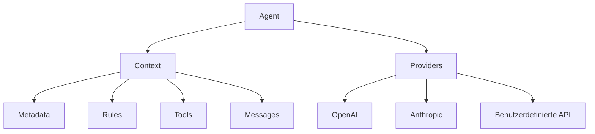

# Arcaelas Agent Dokumentation

Willkommen zur vollständigen Dokumentation von **@arcaelas/agent** - einer produktionsreifen TypeScript-Bibliothek zum Erstellen anspruchsvoller KI-Agenten mit Funktionen auf Unternehmensniveau.

## Was ist Arcaelas Agent?

@arcaelas/agent ist eine fortschrittliche KI-Agenten-Bibliothek, die **reaktive Kontextvererbung**, **intelligente Multi-Anbieter-Ausfallsicherung** und **erweiterbare Werkzeug-Orchestrierung** kombiniert, um Agenten zu erstellen, die von einfachen Chatbots bis zu komplexen Unternehmens-Workflows skalieren.

### Hauptfunktionen

- **🔄 Multi-Anbieter-Unterstützung**: Automatische Ausfallsicherung zwischen OpenAI, Anthropic, Groq und benutzerdefinierten APIs
- **🏗️ Reaktive Architektur**: Kontextvererbungssystem mit automatischer Zustandsverwaltung
- **🛠️ Werkzeug-Ökosystem**: Integrierte HTTP-Werkzeuge, Zeit-Dienstprogramme und nahtlose Integration benutzerdefinierter Funktionen
- **💎 Vollständiges TypeScript**: Vollständige Typsicherheit mit diskriminierten Unions und Generics
- **⚡ Hohe Leistung**: Für die Produktion optimiert mit intelligentem Lastausgleich
- **🎯 Entwicklererfahrung**: Intuitive API, die Komplexität reduziert und gleichzeitig Kontrolle behält

## Schnellstart

### Installation

Installieren Sie mit Ihrem bevorzugten Paketmanager:

=== "npm"
    ```bash
    npm install @arcaelas/agent
    ```

=== "yarn"
    ```bash
    yarn add @arcaelas/agent
    ```

=== "pnpm"
    ```bash
    pnpm add @arcaelas/agent
    ```

=== "bun"
    ```bash
    bun add @arcaelas/agent
    ```

### Ihr erster Agent

Erstellen Sie einen einfachen KI-Agenten in nur wenigen Zeilen:

```typescript
import { Agent } from '@arcaelas/agent';
import OpenAI from 'openai';

// OpenAI-Client initialisieren
const openai = new OpenAI({
  baseURL: "https://api.openai.com/v1",
  apiKey: process.env.OPENAI_API_KEY
});

// Agent mit Anbieter erstellen
const assistant = new Agent({
  name: "Persönlicher_Assistent",
  description: "Hilfreicher Assistent für tägliche Aufgaben und Fragen",
  providers: [
    async (ctx) => {
      return await openai.chat.completions.create({
        model: "gpt-4",
        messages: ctx.messages.map(m => ({
          role: m.role,
          content: m.content
        }))
      });
    }
  ]
});

// Konversation starten
const [messages, success] = await assistant.call("Wie ist das Wetter heute?");

if (success) {
  const response = messages[messages.length - 1].content;
  console.log("Assistent:", response);
}
```

## Kernkonzepte

### Agent

Der zentrale Orchestrator, der Identität, Verhalten, Werkzeuge und Intelligenzanbieter zu einer zusammenhängenden Konversationserfahrung kombiniert.

```typescript
const agent = new Agent({
  name: "Support_Agent",
  description: "Kundensupport-Spezialist",
  tools: [search_tool, database_tool],
  rules: [professional_rule],
  providers: [openai_provider]
});
```

**[Mehr über Agent erfahren →](api/agent.md)**

### Kontext

Reaktives Zustandsverwaltungssystem, das hierarchische Konfiguration mit automatischer Vererbung bereitstellt.

```typescript
const parent_context = new Context({
  metadata: new Metadata().set("company", "Acme Corp"),
  rules: [new Rule("Professionellen Ton beibehalten")]
});

const child_context = new Context({
  context: parent_context,  // Erbt vom Eltern
  metadata: new Metadata().set("department", "Vertrieb")
});
```

**[Mehr über Kontext erfahren →](api/context.md)**

### Werkzeuge

Erweiterbares System, das es Agenten ermöglicht, benutzerdefinierte Funktionen auszuführen, HTTP-Anfragen zu stellen und mit externen Diensten zu interagieren.

```typescript
const weather_tool = new Tool("get_weather", {
  description: "Aktuelles Wetter für jede Stadt abrufen",
  parameters: {
    city: "Stadtname (z.B. 'Berlin', 'München')",
    units: "Temperatureinheiten: 'celsius' oder 'fahrenheit'"
  },
  func: async (params) => {
    return `Wetter in ${params.city}: Sonnig, 24°C`;
  }
});
```

**[Mehr über Werkzeuge erfahren →](api/tool.md)**

### Anbieter

Multi-Anbieter-Architektur, die hohe Verfügbarkeit durch automatische Ausfallsicherung über verschiedene KI-Dienste gewährleistet.

```typescript
const agent = new Agent({
  name: "Widerstandsfähiger_Agent",
  description: "Hochverfügbarkeits-Agent",
  providers: [
    async (ctx) => await openai_provider(ctx),  // Primär
    async (ctx) => await claude_provider(ctx)   // Backup
  ]
});
```

**[Mehr über Anbieter erfahren →](guides/providers.md)**

## Architekturübersicht



## Anwendungsfälle

### Einfacher Chatbot

Perfekt für grundlegende Konversations-KI:

```typescript
const chatbot = new Agent({
  name: "Einfacher_Chatbot",
  description: "Freundlicher Assistent für grundlegende Fragen",
  providers: [openai_provider]
});

await chatbot.call("Erzähl mir einen Witz");
```

**[Vollständiges Beispiel ansehen →](examples/basic-agent.md)**

### Multi-Anbieter-Konfiguration

Produktionsbereit mit automatischer Ausfallsicherung:

```typescript
const advanced_agent = new Agent({
  name: "Erweiterter_Assistent",
  description: "Intelligenter Assistent mit Ausfallsicherung",
  tools: [weather_tool, time_tool],
  providers: [openai_provider, claude_provider]  // Automatische Ausfallsicherung
});
```

**[Vollständiges Beispiel ansehen →](examples/multi-provider.md)**

### Unternehmensarchitektur

Skalierbare Unternehmenskonfiguration mit Kontextvererbung:

```typescript
const company_context = new Context({
  metadata: new Metadata()
    .set("organization", "Acme Corp")
    .set("compliance_level", "enterprise"),
  rules: [
    new Rule("Vertrauliche Informationen schützen"),
    new Rule("Alle Interaktionen für Audit protokollieren")
  ]
});

const sales_agent = new Agent({
  name: "Vertriebs_Spezialist",
  description: "Experten-Vertriebsmitarbeiter",
  contexts: company_context,  // Erbt Unternehmensrichtlinien
  tools: [crm_tool, quote_tool]
});
```

**[Vollständiges Beispiel ansehen →](examples/context-inheritance.md)**

## Dokumentationsstruktur

### 📚 Anleitungen

Beginnen Sie hier, wenn Sie neu bei @arcaelas/agent sind:

- **[Erste Schritte](guides/getting-started.md)** - Vollständiges Tutorial von der Installation bis zum ersten Agenten
- **[Kernkonzepte](guides/core-concepts.md)** - Die Architektur verstehen
- **[Anbieter](guides/providers.md)** - Mehrere KI-Anbieter einrichten
- **[Best Practices](guides/best-practices.md)** - Produktionsmuster und Empfehlungen

### 🔧 API-Referenz

Vollständige Dokumentation für alle Klassen und Schnittstellen:

- **[Agent](api/agent.md)** - Hauptorchestrator-Klasse
- **[Context](api/context.md)** - Reaktive Zustandsverwaltung
- **[Metadata](api/metadata.md)** - Schlüssel-Wert-Speicher mit Vererbung
- **[Tool](api/tool.md)** - Benutzerdefiniertes Funktionssystem
- **[Rule](api/rule.md)** - Verhaltensrichtlinien
- **[Message](api/message.md)** - Konversationsnachrichten
- **[Providers](api/providers.md)** - Anbieter-Funktionssignatur
- **[Built-in Tools](api/built-in-tools.md)** - RemoteTool & TimeTool

### 💡 Beispiele

Praktische Beispiele für häufige Anwendungsfälle:

- **[Basic Agent](examples/basic-agent.md)** - Einfacher Chatbot
- **[Multi-Provider](examples/multi-provider.md)** - Widerstandsfähige Konfiguration
- **[Custom Tools](examples/custom-tools.md)** - Eigene Werkzeuge erstellen
- **[Context Inheritance](examples/context-inheritance.md)** - Unternehmensmuster
- **[Advanced Patterns](examples/advanced-patterns.md)** - Komplexe Szenarien

### 🎓 Erweitert

Vertiefungen für erfahrene Benutzer:

- **[Architecture](advanced/architecture.md)** - Internes Design und Muster
- **[Performance](advanced/performance.md)** - Optimierungstechniken
- **[Troubleshooting](advanced/troubleshooting.md)** - Häufige Probleme und Lösungen
- **[Migration](advanced/migration.md)** - Upgrade von früheren Versionen

## Anforderungen

- **Node.js** ≥ 16.0.0
- **TypeScript** ≥ 4.5.0 (für TypeScript-Projekte)
- **Moderner Browser** (ES2020+ Unterstützung für Browser-Nutzung)

## Kompatibilität

| Funktion | Status |
|---------|--------|
| OpenAI API | ✅ Vollständige Unterstützung |
| Anthropic Claude | ✅ Vollständige Unterstützung |
| Groq | ✅ Vollständige Unterstützung |
| Benutzerdefinierte Anbieter | ✅ Vollständige Unterstützung |
| Browser-Unterstützung | ✅ ES-Module & UMD |
| TypeScript | ✅ Vollständige Typsicherheit |

## Schnelllinks

- [GitHub-Repository](https://github.com/arcaelas/agent)
- [NPM-Paket](https://www.npmjs.com/package/@arcaelas/agent)
- [Issue-Tracker](https://github.com/arcaelas/agent/issues)
- [Änderungsprotokoll](CHANGELOG.md)

## Hilfe erhalten

- **GitHub Issues** - [Fehler melden oder Funktionen anfordern](https://github.com/arcaelas/agent/issues)
- **Discussions** - [Fragen stellen oder Ideen teilen](https://github.com/arcaelas/agent/discussions)
- **Discord** - [Unserer Community beitreten](https://discord.gg/arcaelas)

## Lizenz

MIT-Lizenz - Siehe [LICENSE](https://github.com/arcaelas/agent/blob/main/LICENSE)

---

**Bereit, intelligente KI-Agenten zu erstellen?** Beginnen Sie mit dem **[Erste-Schritte-Leitfaden](guides/getting-started.md)** →
