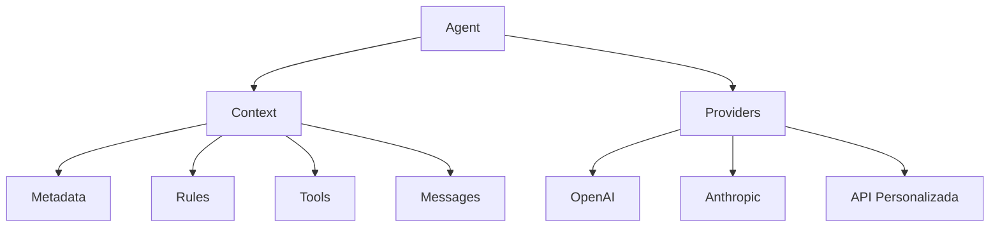

# Documentación de Arcaelas Agent

Bienvenido a la documentación completa de **@arcaelas/agent** - una librería TypeScript lista para producción diseñada para construir agentes de IA sofisticados con características de nivel empresarial.

## ¿Qué es Arcaelas Agent?

@arcaelas/agent es una librería avanzada de agentes de IA que combina **herencia reactiva de contexto**, **conmutación inteligente entre múltiples proveedores**, y **orquestación extensible de herramientas** para crear agentes que escalan desde chatbots simples hasta flujos de trabajo organizacionales complejos.

### Características Clave

- **🔄 Soporte Multi-Proveedor**: Conmutación automática entre OpenAI, Anthropic, Groq y APIs personalizadas
- **🏗️ Arquitectura Reactiva**: Sistema de herencia de contexto con gestión automática de estado
- **🛠️ Ecosistema de Herramientas**: Herramientas HTTP integradas, utilidades de tiempo e integración fluida de funciones personalizadas
- **💎 TypeScript Completo**: Seguridad de tipos completa con uniones discriminadas y genéricos
- **⚡ Alto Rendimiento**: Optimizado para producción con balanceo de carga inteligente
- **🎯 Experiencia de Desarrollador**: API intuitiva que reduce la complejidad manteniendo el control

## Inicio Rápido

### Instalación

Instala usando tu gestor de paquetes preferido:

=== "npm"
    ```bash
    npm install @arcaelas/agent
    ```

=== "yarn"
    ```bash
    yarn add @arcaelas/agent
    ```

=== "pnpm"
    ```bash
    pnpm add @arcaelas/agent
    ```

=== "bun"
    ```bash
    bun add @arcaelas/agent
    ```

### Tu Primer Agente

Crea un agente de IA simple en solo unas líneas:

```typescript
import { Agent } from '@arcaelas/agent';
import OpenAI from 'openai';

// Inicializar cliente OpenAI
const openai = new OpenAI({
  baseURL: "https://api.openai.com/v1",
  apiKey: process.env.OPENAI_API_KEY
});

// Crear agente con proveedor
const assistant = new Agent({
  name: "Asistente_Personal",
  description: "Asistente útil para tareas diarias y preguntas",
  providers: [
    async (ctx) => {
      return await openai.chat.completions.create({
        model: "gpt-4",
        messages: ctx.messages.map(m => ({
          role: m.role,
          content: m.content
        }))
      });
    }
  ]
});

// Iniciar conversación
const [messages, success] = await assistant.call("¿Cómo está el clima hoy?");

if (success) {
  const response = messages[messages.length - 1].content;
  console.log("Asistente:", response);
}
```

## Conceptos Básicos

### Agente

El orquestador central que combina identidad, comportamiento, herramientas y proveedores de inteligencia en una experiencia conversacional cohesiva.

```typescript
const agent = new Agent({
  name: "Agente_Soporte",
  description: "Especialista en soporte al cliente",
  tools: [search_tool, database_tool],
  rules: [professional_rule],
  providers: [openai_provider]
});
```

**[Aprende más sobre Agente →](api/agent.md)**

### Contexto

Sistema de gestión de estado reactivo que proporciona configuración jerárquica con herencia automática.

```typescript
const parent_context = new Context({
  metadata: new Metadata().set("company", "Acme Corp"),
  rules: [new Rule("Mantener tono profesional")]
});

const child_context = new Context({
  context: parent_context,  // Hereda del padre
  metadata: new Metadata().set("department", "Ventas")
});
```

**[Aprende más sobre Contexto →](api/context.md)**

### Herramientas

Sistema extensible que permite a los agentes ejecutar funciones personalizadas, realizar solicitudes HTTP e interactuar con servicios externos.

```typescript
const weather_tool = new Tool("get_weather", {
  description: "Obtener clima actual para cualquier ciudad",
  parameters: {
    city: "Nombre de la ciudad (ej: 'Madrid', 'Barcelona')",
    units: "Unidades de temperatura: 'celsius' o 'fahrenheit'"
  },
  func: async (params) => {
    return `Clima en ${params.city}: Soleado, 24°C`;
  }
});
```

**[Aprende más sobre Herramientas →](api/tool.md)**

### Proveedores

Arquitectura multi-proveedor que garantiza alta disponibilidad mediante conmutación automática entre diferentes servicios de IA.

```typescript
const agent = new Agent({
  name: "Agente_Resiliente",
  description: "Agente de alta disponibilidad",
  providers: [
    async (ctx) => await openai_provider(ctx),  // Primario
    async (ctx) => await claude_provider(ctx)   // Respaldo
  ]
});
```

**[Aprende más sobre Proveedores →](guides/providers.md)**

## Visión General de Arquitectura



## Casos de Uso

### Chatbot Simple

Perfecto para IA conversacional básica:

```typescript
const chatbot = new Agent({
  name: "Chatbot_Simple",
  description: "Asistente amigable para preguntas básicas",
  providers: [openai_provider]
});

await chatbot.call("Cuéntame un chiste");
```

**[Ver ejemplo completo →](examples/basic-agent.md)**

### Configuración Multi-Proveedor

Listo para producción con conmutación automática:

```typescript
const advanced_agent = new Agent({
  name: "Asistente_Avanzado",
  description: "Asistente inteligente con conmutación",
  tools: [weather_tool, time_tool],
  providers: [openai_provider, claude_provider]  // Conmutación automática
});
```

**[Ver ejemplo completo →](examples/multi-provider.md)**

### Arquitectura Empresarial

Configuración organizacional escalable con herencia de contexto:

```typescript
const company_context = new Context({
  metadata: new Metadata()
    .set("organization", "Acme Corp")
    .set("compliance_level", "enterprise"),
  rules: [
    new Rule("Proteger información confidencial"),
    new Rule("Registrar todas las interacciones para auditoría")
  ]
});

const sales_agent = new Agent({
  name: "Especialista_Ventas",
  description: "Representante de ventas experto",
  contexts: company_context,  // Hereda políticas de la empresa
  tools: [crm_tool, quote_tool]
});
```

**[Ver ejemplo completo →](examples/context-inheritance.md)**

## Estructura de Documentación

### 📚 Guías

Comienza aquí si eres nuevo en @arcaelas/agent:

- **[Comenzando](guides/getting-started.md)** - Tutorial completo desde la instalación hasta el primer agente
- **[Conceptos Básicos](guides/core-concepts.md)** - Entendiendo la arquitectura
- **[Proveedores](guides/providers.md)** - Configurando múltiples proveedores de IA
- **[Mejores Prácticas](guides/best-practices.md)** - Patrones de producción y recomendaciones

### 🔧 Referencia API

Documentación completa para todas las clases e interfaces:

- **[Agent](api/agent.md)** - Clase orquestadora principal
- **[Context](api/context.md)** - Gestión de estado reactivo
- **[Metadata](api/metadata.md)** - Almacén clave-valor con herencia
- **[Tool](api/tool.md)** - Sistema de funciones personalizadas
- **[Rule](api/rule.md)** - Directrices de comportamiento
- **[Message](api/message.md)** - Mensajes de conversación
- **[Providers](api/providers.md)** - Firma de función de proveedor
- **[Built-in Tools](api/built-in-tools.md)** - RemoteTool y TimeTool

### 💡 Ejemplos

Ejemplos prácticos para casos de uso comunes:

- **[Basic Agent](examples/basic-agent.md)** - Chatbot simple
- **[Multi-Provider](examples/multi-provider.md)** - Configuración resiliente
- **[Custom Tools](examples/custom-tools.md)** - Creando tus propias herramientas
- **[Context Inheritance](examples/context-inheritance.md)** - Patrones empresariales
- **[Advanced Patterns](examples/advanced-patterns.md)** - Escenarios complejos

### 🎓 Avanzado

Profundizaciones para usuarios experimentados:

- **[Architecture](advanced/architecture.md)** - Diseño interno y patrones
- **[Performance](advanced/performance.md)** - Técnicas de optimización
- **[Troubleshooting](advanced/troubleshooting.md)** - Problemas comunes y soluciones
- **[Migration](advanced/migration.md)** - Actualizando desde versiones anteriores

## Requisitos

- **Node.js** ≥ 16.0.0
- **TypeScript** ≥ 4.5.0 (para proyectos TypeScript)
- **Navegador Moderno** (soporte ES2020+ para uso en navegador)

## Compatibilidad

| Característica | Estado |
|---------|--------|
| OpenAI API | ✅ Soporte Completo |
| Anthropic Claude | ✅ Soporte Completo |
| Groq | ✅ Soporte Completo |
| Proveedores Personalizados | ✅ Soporte Completo |
| Soporte de Navegador | ✅ ES Modules & UMD |
| TypeScript | ✅ Seguridad de Tipos Completa |

## Enlaces Rápidos

- [Repositorio GitHub](https://github.com/arcaelas/agent)
- [Paquete NPM](https://www.npmjs.com/package/@arcaelas/agent)
- [Rastreador de Problemas](https://github.com/arcaelas/agent/issues)
- [Registro de Cambios](CHANGELOG.md)

## Obtener Ayuda

- **GitHub Issues** - [Reportar errores o solicitar características](https://github.com/arcaelas/agent/issues)
- **Discussions** - [Hacer preguntas o compartir ideas](https://github.com/arcaelas/agent/discussions)
- **Discord** - [Únete a nuestra comunidad](https://discord.gg/arcaelas)

## Licencia

Licencia MIT - Ver [LICENSE](https://github.com/arcaelas/agent/blob/main/LICENSE)

---

**¿Listo para construir agentes de IA inteligentes?** Comienza con la **[Guía de Inicio](guides/getting-started.md)** →
