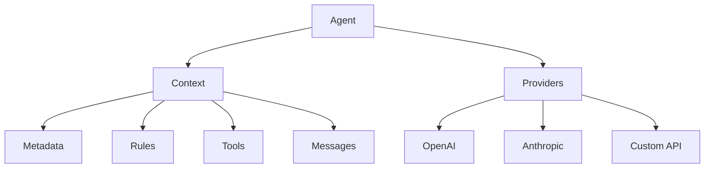

# Arcaelas Agent Documentation

Welcome to the complete documentation for **@arcaelas/agent** - a production-ready TypeScript library for building sophisticated AI agents with enterprise-grade features.

## What is Arcaelas Agent?

@arcaelas/agent is an advanced AI agent library that combines **reactive context inheritance**, **intelligent multi-provider failover**, and **extensible tool orchestration** to create agents that scale from simple chatbots to complex organizational workflows.

### Key Features

- **🔄 Multi-Provider Support**: Automatic failover between OpenAI, Anthropic, Groq, and custom APIs
- **🏗️ Reactive Architecture**: Context inheritance system with automatic state management
- **🛠️ Tool Ecosystem**: Built-in HTTP tools, time utilities, and seamless custom function integration
- **💎 Full TypeScript**: Complete type safety with discriminated unions and generics
- **⚡ High Performance**: Optimized for production with intelligent load balancing
- **🎯 Developer Experience**: Intuitive API that reduces complexity while maintaining control

## Quick Start

### Installation

Install via your preferred package manager:

=== "npm"
    ```bash
    npm install @arcaelas/agent
    ```

=== "yarn"
    ```bash
    yarn add @arcaelas/agent
    ```

=== "pnpm"
    ```bash
    pnpm add @arcaelas/agent
    ```

=== "bun"
    ```bash
    bun add @arcaelas/agent
    ```

### Your First Agent

Create a simple AI agent in just a few lines:

```typescript
import { Agent } from '@arcaelas/agent';
import OpenAI from 'openai';

// Initialize OpenAI client
const openai = new OpenAI({
  baseURL: "https://api.openai.com/v1",
  apiKey: process.env.OPENAI_API_KEY
});

// Create agent with provider
const assistant = new Agent({
  name: "Personal_Assistant",
  description: "Helpful assistant for daily tasks and questions",
  providers: [
    async (ctx) => {
      return await openai.chat.completions.create({
        model: "gpt-4",
        messages: ctx.messages.map(m => ({
          role: m.role,
          content: m.content
        }))
      });
    }
  ]
});

// Start conversation
const [messages, success] = await assistant.call("What's the weather like today?");

if (success) {
  const response = messages[messages.length - 1].content;
  console.log("Assistant:", response);
}
```

## Core Concepts

### Agent

The central orchestrator that combines identity, behavior, tools, and intelligence providers into a cohesive conversational experience.

```typescript
const agent = new Agent({
  name: "Support_Agent",
  description: "Customer support specialist",
  tools: [search_tool, database_tool],
  rules: [professional_rule],
  providers: [openai_provider]
});
```

**[Learn more about Agent →](api/agent.md)**

### Context

Reactive state management system providing hierarchical configuration with automatic inheritance.

```typescript
const parent_context = new Context({
  metadata: new Metadata().set("company", "Acme Corp"),
  rules: [new Rule("Maintain professional tone")]
});

const child_context = new Context({
  context: parent_context,  // Inherits from parent
  metadata: new Metadata().set("department", "Sales")
});
```

**[Learn more about Context →](api/context.md)**

### Tools

Extensible system allowing agents to execute custom functions, make HTTP requests, and interact with external services.

```typescript
const weather_tool = new Tool("get_weather", {
  description: "Get current weather for any city",
  parameters: {
    city: "City name (e.g., 'London', 'New York')",
    units: "Temperature units: 'celsius' or 'fahrenheit'"
  },
  func: async (params) => {
    return `Weather in ${params.city}: Sunny, 24°C`;
  }
});
```

**[Learn more about Tools →](api/tool.md)**

### Providers

Multi-provider architecture ensuring high availability through automatic failover across different AI services.

```typescript
const agent = new Agent({
  name: "Resilient_Agent",
  description: "High-availability agent",
  providers: [
    async (ctx) => await openai_provider(ctx),  // Primary
    async (ctx) => await claude_provider(ctx)   // Backup
  ]
});
```

**[Learn more about Providers →](guides/providers.md)**

## Architecture Overview



## Use Cases

### Simple Chatbot

Perfect for basic conversational AI:

```typescript
const chatbot = new Agent({
  name: "Simple_Chatbot",
  description: "Friendly assistant for basic questions",
  providers: [openai_provider]
});

await chatbot.call("Tell me a joke");
```

**[View complete example →](examples/basic-agent.md)**

### Multi-Provider Setup

Production-ready with automatic failover:

```typescript
const advanced_agent = new Agent({
  name: "Advanced_Assistant",
  description: "Intelligent assistant with failover",
  tools: [weather_tool, time_tool],
  providers: [openai_provider, claude_provider]  // Automatic failover
});
```

**[View complete example →](examples/multi-provider.md)**

### Enterprise Architecture

Scalable organizational setup with context inheritance:

```typescript
const company_context = new Context({
  metadata: new Metadata()
    .set("organization", "Acme Corp")
    .set("compliance_level", "enterprise"),
  rules: [
    new Rule("Protect confidential information"),
    new Rule("Log all interactions for audit")
  ]
});

const sales_agent = new Agent({
  name: "Sales_Specialist",
  description: "Expert sales representative",
  contexts: company_context,  // Inherits company policies
  tools: [crm_tool, quote_tool]
});
```

**[View complete example →](examples/context-inheritance.md)**

## Documentation Structure

### 📚 Guides

Start here if you're new to @arcaelas/agent:

- **[Getting Started](guides/getting-started.md)** - Complete tutorial from installation to first agent
- **[Core Concepts](guides/core-concepts.md)** - Understanding the architecture
- **[Providers](guides/providers.md)** - Setting up multiple AI providers
- **[Best Practices](guides/best-practices.md)** - Production patterns and recommendations

### 🔧 API Reference

Complete documentation for all classes and interfaces:

- **[Agent](api/agent.md)** - Main orchestrator class
- **[Context](api/context.md)** - Reactive state management
- **[Metadata](api/metadata.md)** - Key-value store with inheritance
- **[Tool](api/tool.md)** - Custom function system
- **[Rule](api/rule.md)** - Behavioral guidelines
- **[Message](api/message.md)** - Conversation messages
- **[Providers](api/providers.md)** - Provider function signature
- **[Built-in Tools](api/built-in-tools.md)** - RemoteTool & TimeTool

### 💡 Examples

Practical examples for common use cases:

- **[Basic Agent](examples/basic-agent.md)** - Simple chatbot
- **[Multi-Provider](examples/multi-provider.md)** - Resilient setup
- **[Custom Tools](examples/custom-tools.md)** - Creating your own tools
- **[Context Inheritance](examples/context-inheritance.md)** - Enterprise patterns
- **[Advanced Patterns](examples/advanced-patterns.md)** - Complex scenarios

### 🎓 Advanced

Deep dives for experienced users:

- **[Architecture](advanced/architecture.md)** - Internal design and patterns
- **[Performance](advanced/performance.md)** - Optimization techniques
- **[Troubleshooting](advanced/troubleshooting.md)** - Common issues and solutions
- **[Migration](advanced/migration.md)** - Upgrading from previous versions

## Requirements

- **Node.js** ≥ 16.0.0
- **TypeScript** ≥ 4.5.0 (for TypeScript projects)
- **Modern Browser** (ES2020+ support for browser usage)

## Compatibility

| Feature | Status |
|---------|--------|
| OpenAI API | ✅ Full Support |
| Anthropic Claude | ✅ Full Support |
| Groq | ✅ Full Support |
| Custom Providers | ✅ Full Support |
| Browser Support | ✅ ES Modules & UMD |
| TypeScript | ✅ Full Type Safety |

## Quick Links

- [GitHub Repository](https://github.com/arcaelas/agent)
- [NPM Package](https://www.npmjs.com/package/@arcaelas/agent)
- [Issue Tracker](https://github.com/arcaelas/agent/issues)
- [Changelog](CHANGELOG.md)

## Getting Help

- **GitHub Issues** - [Report bugs or request features](https://github.com/arcaelas/agent/issues)
- **Discussions** - [Ask questions or share ideas](https://github.com/arcaelas/agent/discussions)
- **Discord** - [Join our community](https://discord.gg/arcaelas)

## License

MIT License - See [LICENSE](https://github.com/arcaelas/agent/blob/main/LICENSE)

---

**Ready to build intelligent AI agents?** Start with the **[Getting Started Guide](guides/getting-started.md)** →
